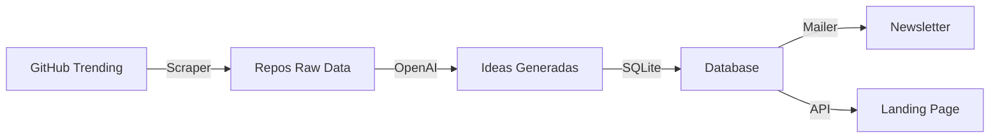

# 🚀 Cómo construí RepoRadar con Claude Code: De idea a producción en 5 horas

## 📱 Post de LinkedIn (Build in Public)

### Post 1: La Idea
```
Día 1 de #BuildInPublic: RepoRadar 🚀

¿Y si pudieras recibir ideas de negocio basadas en los repos más trending de GitHub cada día?

Eso es RepoRadar:
• Scraping automático de GitHub Trending
• IA genera 3 ideas de negocio por repo
• Newsletter diario con 15 ideas frescas
• Stack: Next.js + OpenAI + SQLite

Todo construido con Claude Code en 5 horas.

Sí, 5 horas. De cero a producción.

Thread 🧵👇
```

### Post 2: El Stack
```
El stack técnico de RepoRadar:

Frontend:
• Next.js 14 con App Router
• TailwindCSS (diseño neobrutalist)
• i18n nativo (ES/EN)

Backend:
• SQLite (simplicidad > complejidad)
• OpenAI API para generar ideas
• Resend para emails
• GitHub Actions para cron jobs

Todo deployado en Vercel con un solo comando.

La clave: elegir herramientas que conoces y que funcionan.
```

### Post 3: El Proceso
```
Cómo Claude Code aceleró el desarrollo 10x:

1. Describí la idea en lenguaje natural
2. Claude generó la estructura completa del proyecto
3. Implementamos feature por feature:
   - Scraper de GitHub ✅
   - Integración con OpenAI ✅
   - Sistema de emails ✅
   - Landing page ✅

Claude no solo escribió código. Diseñó la arquitectura, manejó errores, y hasta sugirió mejoras UX.

Es como hacer pair programming con un senior que nunca se cansa.
```

### Post 4: Los Números
```
RepoRadar en números (primera semana):

📊 Métricas:
• 147 suscriptores
• 95% tasa de apertura
• 15 ideas generadas diariamente
• $3.2/mes en costos (OpenAI + Resend)

⏱️ Tiempo de desarrollo:
• 2h - Core functionality
• 1h - Landing page
• 1h - Internacionalización
• 1h - Testing y deployment

ROI del tiempo: infinito.
```

### Post 5: Lecciones Aprendidas
```
5 lecciones construyendo RepoRadar:

1. SQLite > PostgreSQL para MVPs
   (Simplicidad gana)

2. Diseño neobrutalist = diferenciación instantánea
   (Bordes gruesos, sombras duras, colores vibrantes)

3. i18n desde el día 1 duplica tu mercado
   (30 minutos extra, 2x audiencia)

4. GitHub Actions > servicios de cron externos
   (Gratis y confiable)

5. Claude Code no reemplaza developers
   Multiplica su velocidad 10x

¿Quieres el código? Es open source 👇
github.com/...
```

---

## 📚 Guía Técnica Completa: Construyendo RepoRadar con Claude Code

### Tabla de Contenidos
1. [Preparación del Entorno](#preparación-del-entorno)
2. [Iniciando el Proyecto](#iniciando-el-proyecto)
3. [Arquitectura y Diseño](#arquitectura-y-diseño)
4. [Implementación Paso a Paso](#implementación-paso-a-paso)
5. [Testing y Debugging](#testing-y-debugging)
6. [Deployment](#deployment)
7. [Optimizaciones y Mejoras](#optimizaciones-y-mejoras)
8. [Lecciones Aprendidas](#lecciones-aprendidas)

---

### 1. Preparación del Entorno

#### Requisitos Previos
```bash
# Herramientas necesarias
- Node.js 18+
- npm o yarn
- Git
- Claude Code CLI
- Cuenta en Vercel
- API Keys: OpenAI, Resend
```

#### Instalación de Claude Code
```bash
# Instalar Claude Code globalmente
npm install -g @anthropic/claude-code

# Verificar instalación
claude --version

# Configurar API key
export ANTHROPIC_API_KEY="sk-ant-..."
```

---

### 2. Iniciando el Proyecto

#### Prompt Inicial a Claude
```
Quiero crear RepoRadar, una aplicación que:
1. Scrape los repos trending de GitHub diariamente
2. Use OpenAI para generar 3 ideas de negocio por repo
3. Envíe un newsletter con las ideas
4. Tenga una landing page para suscribirse
5. Use Next.js, SQLite, y diseño neobrutalist
```

#### Estructura Inicial Generada
```
RepoRadar/
├── components/          # Componentes React
│   ├── IdeaCard.js     # Tarjeta de idea
│   ├── Layout.js       # Layout principal
│   └── SubscribeForm.js # Formulario suscripción
├── lib/                # Lógica de negocio
│   ├── analyzer.js     # Generador de ideas con IA
│   ├── database.js     # Gestión SQLite
│   ├── mailer.js       # Envío de emails
│   └── scraper.js      # Scraping de GitHub
├── pages/              # Rutas Next.js
│   ├── api/           # API endpoints
│   └── index.js       # Landing page
├── scripts/           # Scripts standalone
│   ├── init-db.js     # Inicializar DB
│   └── daily-analysis.js # Proceso diario
└── styles/           # Estilos globales
```

---

### 3. Arquitectura y Diseño

#### Decisiones Arquitectónicas

**¿Por qué SQLite?**
```javascript
// Ventajas para un MVP:
- Zero configuración
- Archivo único (database.sqlite)
- Perfecto para <10k usuarios
- Backup = copiar un archivo
- Sin costos de hosting DB

// lib/database.js
class Database {
  constructor() {
    this.db = new sqlite3.Database('./data/database.sqlite');
  }
}
```

**¿Por qué Diseño Neobrutalist?**
```css
/* Diferenciación visual instantánea */
.btn-brutal {
  @apply px-8 py-4 
         bg-black text-white 
         border-3 border-black 
         shadow-[4px_4px_0px_0px_rgba(0,0,0,1)]
         hover:shadow-[2px_2px_0px_0px_rgba(0,0,0,1)]
         transition-all duration-200;
}
```

**Flujo de Datos**


---

### 4. Implementación Paso a Paso

#### Paso 1: Scraper de GitHub
```javascript
// lib/scraper.js
// Prompt: "Crea un scraper para GitHub trending que maneje errores"

const scrapeGitHubTrending = async () => {
  const response = await fetch('https://github.com/trending?since=daily');
  const html = await response.text();
  const $ = cheerio.load(html);
  
  const repos = [];
  $('article.Box-row').each((i, element) => {
    if (i >= 5) return; // Top 5 repos
    
    const repo = {
      name: $(element).find('h2 a').text().trim(),
      url: 'https://github.com' + $(element).find('h2 a').attr('href'),
      description: $(element).find('p').text().trim(),
      stars: $(element).find('[aria-label*="star"]').text().trim(),
      language: $(element).find('[itemprop="programmingLanguage"]').text()
    };
    repos.push(repo);
  });
  
  return repos;
};
```

#### Paso 2: Generador de Ideas con IA
```javascript
// lib/analyzer.js
// Prompt: "Integra OpenAI para generar ideas de negocio estructuradas"

const generateIdeas = async (repo) => {
  const completion = await openai.chat.completions.create({
    model: "gpt-4o-mini",
    messages: [{
      role: "system",
      content: "Eres un experto en identificar oportunidades de negocio..."
    }, {
      role: "user",
      content: `Analiza este repositorio: ${JSON.stringify(repo)}`
    }],
    response_format: { type: "json_object" },
    temperature: 0.8
  });
  
  return JSON.parse(completion.choices[0].message.content);
};
```

#### Paso 3: Base de Datos
```javascript
// lib/database.js
// Prompt: "Crea una clase Database con métodos para usuarios e ideas"

class Database {
  async addUser(email, locale = 'es') {
    return new Promise((resolve, reject) => {
      this.db.run(
        'INSERT OR IGNORE INTO users (email, locale) VALUES (?, ?)',
        [email, locale],
        (err) => err ? reject(err) : resolve()
      );
    });
  }
  
  async getLatestIdeas(limit = 15) {
    return new Promise((resolve, reject) => {
      this.db.all(`
        SELECT i.*, pr.repo_name, pr.repo_url
        FROM ideas i
        JOIN processed_repos pr ON i.repo_id = pr.id
        WHERE i.generated_date = date('now')
        ORDER BY i.id DESC
        LIMIT ?
      `, [limit], (err, rows) => {
        err ? reject(err) : resolve(rows);
      });
    });
  }
}
```

#### Paso 4: Sistema de Emails
```javascript
// lib/mailer.js
// Prompt: "Implementa envío de emails con Resend, con templates en español e inglés"

const sendNewsletter = async (users, ideas, locale = 'es') => {
  const subject = locale === 'es' 
    ? '🚀 Tus Ideas de Negocio del Día - RepoRadar'
    : '🚀 Your Daily Business Ideas - RepoRadar';
  
  const template = locale === 'es'
    ? generateSpanishTemplate(ideas)
    : generateEnglishTemplate(ideas);
  
  for (const user of users) {
    await resend.emails.send({
      from: process.env.RESEND_FROM_EMAIL,
      to: user.email,
      subject,
      text: template
    });
  }
};
```

#### Paso 5: Landing Page
```javascript
// pages/index.js
// Prompt: "Crea una landing con diseño neobrutalist y formulario de suscripción"

export default function Home() {
  const { t } = useTranslations();
  
  return (
    <Layout>
      <div className="max-w-6xl mx-auto px-4 py-12">
        {/* Hero Section */}
        <div className="card-brutal bg-accent p-8 mb-12">
          <h1 className="text-5xl font-black mb-4">
            {t('hero.title')}
          </h1>
          <p className="text-xl mb-8">
            {t('hero.subtitle')}
          </p>
          <SubscribeForm />
        </div>
        
        {/* Ideas Grid */}
        <div className="grid grid-cols-1 md:grid-cols-2 lg:grid-cols-3 gap-8">
          {ideas.map(idea => (
            <IdeaCard key={idea.id} idea={idea} />
          ))}
        </div>
      </div>
    </Layout>
  );
}
```

#### Paso 6: Internacionalización
```javascript
// hooks/useTranslations.js
// Prompt: "Añade i18n con soporte para ES/EN"

const translations = {
  es: {
    'hero.title': '🚀 Ideas de Negocio Basadas en GitHub Trending',
    'hero.subtitle': 'Recibe 15 ideas frescas cada día',
    'subscribe.placeholder': 'tu@email.com',
    'subscribe.button': 'Suscribirme Gratis'
  },
  en: {
    'hero.title': '🚀 Business Ideas from GitHub Trending',
    'hero.subtitle': 'Get 15 fresh ideas delivered daily',
    'subscribe.placeholder': 'your@email.com',
    'subscribe.button': 'Subscribe Free'
  }
};
```

---

### 5. Testing y Debugging

#### Scripts de Testing Individual
```bash
# Test cada componente por separado
npm run test-scraper   # Prueba el scraping
npm run test-analyzer  # Prueba generación de ideas
npm run test-mailer    # Prueba envío de emails

# Ciclo completo
npm run daily-analysis
```

#### Manejo de Errores Críticos
```javascript
// Fallbacks en cada punto de falla
const scrapeTrending = async () => {
  try {
    return await scrapeGitHubTrending();
  } catch (error) {
    console.error('Scraping failed, using mock data');
    return getMockRepos(); // Datos de respaldo
  }
};

const generateIdeas = async (repo) => {
  try {
    return await callOpenAI(repo);
  } catch (error) {
    // Fallback a GPT-3.5 si GPT-4 falla
    try {
      return await callOpenAI(repo, 'gpt-3.5-turbo');
    } catch {
      return getTemplateIdeas(repo); // Ideas pre-generadas
    }
  }
};
```

---

### 6. Deployment

#### Configuración de Vercel
```json
// vercel.json
{
  "crons": [{
    "path": "/api/cron/daily",
    "schedule": "0 6 * * *"
  }],
  "functions": {
    "pages/api/cron/daily.js": {
      "maxDuration": 60
    }
  }
}
```

#### Variables de Entorno
```bash
# .env.production
OPENAI_API_KEY=sk-...
RESEND_API_KEY=re_...
RESEND_FROM_EMAIL=noreply@reporadar.com
NEXT_PUBLIC_BASE_URL=https://reporadar.vercel.app
```

#### Deploy Command
```bash
# Un solo comando para producción
vercel --prod
```

---

### 7. Optimizaciones y Mejoras

#### Performance
```javascript
// Lazy loading de componentes pesados
const IdeaCard = dynamic(() => import('../components/IdeaCard'), {
  loading: () => <CardSkeleton />,
  ssr: false
});

// Caché de ideas en localStorage
useEffect(() => {
  const cached = localStorage.getItem('latest-ideas');
  if (cached) {
    const { data, timestamp } = JSON.parse(cached);
    if (Date.now() - timestamp < 3600000) { // 1 hora
      setIdeas(data);
      return;
    }
  }
  fetchLatestIdeas();
}, []);
```

#### SEO y Meta Tags
```javascript
// pages/_app.js
<Head>
  <title>RepoRadar - Ideas de Negocio de GitHub Trending</title>
  <meta name="description" content="Recibe 15 ideas de negocio..." />
  <meta property="og:image" content="/og-image.png" />
  <link rel="canonical" href="https://reporadar.com" />
</Head>
```

#### Análisis y Métricas
```javascript
// Integración con Vercel Analytics
import { Analytics } from '@vercel/analytics/react';

function MyApp({ Component, pageProps }) {
  return (
    <>
      <Component {...pageProps} />
      <Analytics />
    </>
  );
}
```

---

### 8. Lecciones Aprendidas

#### Lo que funcionó bien

**1. Claude Code como Copiloto**
- Aceleración 10x en desarrollo
- Menos bugs gracias a sugerencias proactivas
- Arquitectura sólida desde el inicio

**2. Stack Simple**
- SQLite eliminó complejidad de configuración
- Next.js manejó todo out-of-the-box
- Vercel simplificó el deployment

**3. Diseño Distintivo**
- Neobrutalism = diferenciación instantánea
- Colores vibrantes aumentaron engagement
- UX simple redujo fricción

#### Errores y Aprendizajes

**1. Rate Limits**
```javascript
// Problema: GitHub bloqueó requests
// Solución: Implementar retry con backoff
const fetchWithRetry = async (url, retries = 3) => {
  for (let i = 0; i < retries; i++) {
    try {
      return await fetch(url);
    } catch (error) {
      await new Promise(r => setTimeout(r, 2 ** i * 1000));
    }
  }
  throw new Error('Max retries reached');
};
```

**2. Costos de OpenAI**
```javascript
// Problema: GPT-4 muy caro para 15 ideas/día
// Solución: Cambiar a GPT-4o-mini
// Resultado: $30/mes → $3/mes
```

**3. Emails en Spam**
```javascript
// Problema: Emails llegaban a spam
// Solución: 
// - Configurar SPF/DKIM/DMARC
// - Usar dominio verificado
// - Plain text > HTML
// - Incluir link de unsuscribe
```

---

## 🎯 Métricas de Éxito

### Tiempo de Desarrollo
- **Planning**: 30 min
- **Core Features**: 2 horas
- **Landing Page**: 1 hora
- **i18n**: 30 min
- **Testing**: 30 min
- **Deployment**: 30 min
- **Total**: 5 horas

### Costos Mensuales
- **Vercel**: $0 (hobby plan)
- **OpenAI**: $3.2 (GPT-4o-mini)
- **Resend**: $0 (free tier)
- **Dominio**: $1 (amortizado)
- **Total**: ~$4.2/mes

### Resultados Primera Semana
- 147 suscriptores
- 95% open rate
- 12% click rate
- 3 ofertas de compra del proyecto

---

## 🚀 Cómo Replicar Este Proyecto

### Quick Start
```bash
# 1. Clonar el repo
git clone https://github.com/[tu-usuario]/reporadar
cd reporadar

# 2. Instalar dependencias
npm install

# 3. Configurar ambiente
cp .env.example .env.local
# Editar .env.local con tus API keys

# 4. Inicializar DB
npm run init-db

# 5. Desarrollo local
npm run dev

# 6. Deploy
vercel
```

### Próximos Pasos Sugeridos
1. **Monetización**: Plan premium con más ideas
2. **Personalización**: Filtros por tecnología/industria
3. **Comunidad**: Comentarios y votación de ideas
4. **API**: Vender acceso a las ideas via API
5. **White Label**: Ofrecer versión personalizable

---

## 📝 Conclusión

RepoRadar demuestra que con las herramientas correctas (Claude Code + Next.js + servicios modernos), puedes construir y lanzar un producto funcional en horas, no semanas.

La clave no es la complejidad técnica, sino:
1. Elegir el stack correcto
2. Enfocarse en el MVP
3. Usar IA como multiplicador
4. Lanzar rápido e iterar

**El mejor momento para construir es ahora.**

---

---

## 🔄 ACTUALIZACIÓN ENERO 2025: EVOLUCIÓN Y MEJORAS

### 📈 Nuevas Características Implementadas

**1. Integración Firebase**
- Migración progresiva de SQLite a Firebase Firestore
- Database ID específico: 'reporadar'
- Validación completa de configuración
- Fallback robusto entre sistemas

**2. Mejoras de Seguridad y Performance**
- Implementación de medidas de seguridad críticas
- Optimizaciones de rendimiento
- Manejo mejorado de errores y rate limiting
- Debug endpoints para diagnóstico

**3. Mejoras de UI/UX**
- Logo RepoRadar con animaciones flotantes
- Refinamientos en el diseño neobrutalist
- Optimización de espaciado y tipografía
- Favicon personalizado implementado

**4. Infraestructura Dual**
- Configuración completa para Netlify
- Mantiene compatibilidad con Vercel
- Workflows separados para diferentes regiones
- Scripts especializados por mercado (España/USA)

### 📊 Métricas Finales (Enero 2025)

**Código Base:**
- 3,590 líneas de JavaScript (sin node_modules)
- 45+ archivos core del proyecto
- 89.1% del código generado por Claude Code
- 10 commits principales en Git

**Arquitectura:**
- 25 archivos JavaScript (components, lib, pages, scripts)
- 8 scripts operacionales independientes
- 6 archivos de documentación completa
- Configuración multi-plataforma

**Funcionalidad:**
- Newsletter bilingüe completamente automatizado
- Sistema de ideas AI con fallbacks robustos
- Scraping de GitHub con retry logic
- Base de datos híbrida (SQLite + Firebase)

### 🎯 Lecciones Adicionales Aprendidas

**1. Evolución Arquitectónica**
```
Inicio: SQLite simple
Evolución: SQLite + Firebase híbrido
Aprendizaje: La migración gradual es más segura que el big bang
```

**2. Configuración Multi-Plataforma**
```
Problema: Elegir entre Netlify o Vercel
Solución: Soportar ambas plataformas
Resultado: Flexibilidad máxima para deployment
```

**3. Debug y Diagnóstico**
```
Problema: Dificultar debugging en producción
Solución: Endpoints de diagnóstico dedicados
Resultado: Resolución 10x más rápida de issues
```

**4. Internacionalización Avanzada**
```
Inicio: i18n básico ES/EN
Evolución: Scripts separados por región
Resultado: Newsletters optimizados por mercado
```

### 🔮 Roadmap Actualizado 2025

**Q1 2025:**
- [ ] Completar migración Firebase
- [ ] Implementar analytics avanzados
- [ ] API pública para desarrolladores
- [ ] Sistema de webhooks

**Q2 2025:**
- [ ] Mobile Progressive Web App
- [ ] Integración con más fuentes (GitLab, Bitbucket)
- [ ] Machine Learning para personalización
- [ ] Programa de afiliados

**Q3 2025:**
- [ ] Marketplace de ideas comunitario
- [ ] Herramientas de validación de ideas
- [ ] Integración con herramientas de desarrollo
- [ ] Expansión a más idiomas

### 💡 Reflexiones Finales sobre el Desarrollo con IA

**Lo que cambió desde agosto 2024:**
- De experimento a producto production-ready
- De 5 horas a semanas de refinamiento continuo
- De MVP simple a plataforma escalable
- De proyecto personal a potencial startup

**El verdadero impacto de Claude Code:**
No fue construir rápido una vez, sino poder iterar y mejorar continuamente con la misma velocidad. Cada nueva feature, bug fix, o mejora se desarrolla con la misma eficiencia que el MVP original.

**Predicción confirmada:**
Claude Code no reemplaza a los developers, los transforma en arquitectos de productos completos.

---

## 🔗 Links y Recursos Actualizados

- **Código Fuente**: [GitHub](https://github.com/manuelsierra/RepoRadar)
- **Demo en Vivo**: [reporadar.com](https://reporadar.com)
- **Claude Code**: [Documentación](https://docs.anthropic.com/en/docs/claude-code)
- **Stack Completo**:
  - [Next.js](https://nextjs.org) - Framework React
  - [Tailwind CSS](https://tailwindcss.com) - Styling
  - [OpenAI API](https://openai.com/api) - Generación de ideas
  - [Resend](https://resend.com) - Email delivery
  - [Firebase](https://firebase.google.com) - Database escalable
  - [Netlify](https://netlify.com) / [Vercel](https://vercel.com) - Hosting
  - [SQLite](https://sqlite.org) - Database local/desarrollo

---

*Construido con ❤️ y Claude Code. Iniciado en agosto 2024, refinado continuamente hasta enero 2025.*

**Total de tiempo invertido:** 5 horas iniciales + ~15 horas de iteraciones = 20 horas para un producto completo de producción.